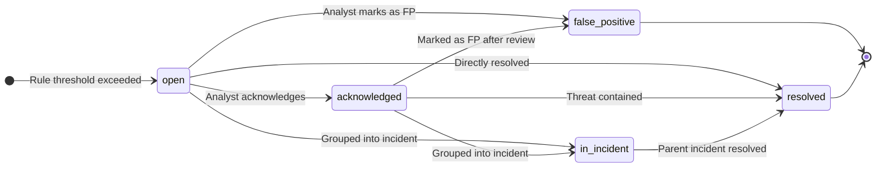
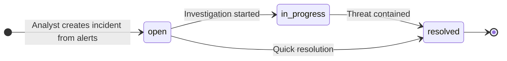
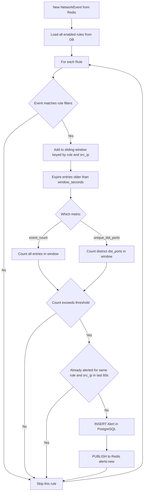

# Alert Lifecycle — State Machine Diagram

**Transitions via API:**
| Transition | Endpoint |
|---|---|
| Any status | `PATCH /api/alerts/{id}` with `{ "status": "..." }` |
| Group into incident | `POST /api/incidents` with `alert_ids` list |

**Notes:**
- Alert is created with `status = open` and `ai_analysis = null`
- AI Agent 1 fills `ai_analysis` asynchronously within seconds of creation
- An alert grouped into an incident gets `incident_id` set and AI Agent 2 analyzes the whole incident

---

# Incident Lifecycle — State Machine Diagram

**Notes:**
- Incident is created via `POST /api/incidents` with a list of `alert_ids`
- AI Agent 2 runs immediately after creation as a background task
- `ai_remediation` and `timeline` fields start as null and are filled by Agent 2

---

# Rule Evaluation Flow

