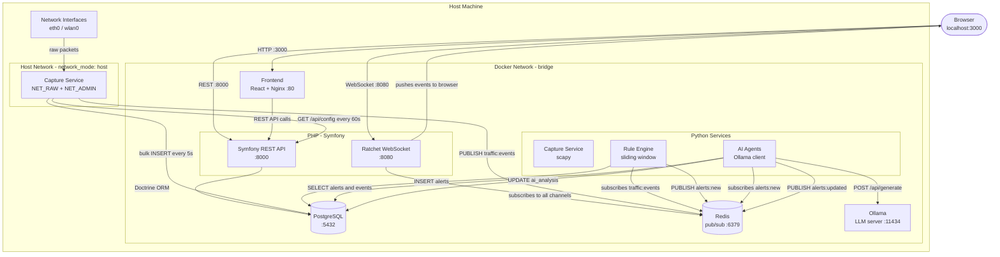

# System Architecture Diagram

## Component Architecture

> Note: The Capture Service uses `network_mode: host` to access real network interfaces.
> It appears outside the Docker bridge network but connects to Redis and PostgreSQL via
> `localhost` (the host's exposed ports).

---

## Language Boundaries

| Component | Language / Framework | Container |
|---|---|---|
| REST API | PHP / Symfony 7 | `backend` |
| WebSocket server | PHP / Ratchet | `backend` (same container, different port) |
| Packet capture | Python / scapy | `capture` |
| Rule engine | Python | `rules` |
| AI agents | Python | `agents` |
| Frontend | React / TypeScript | `frontend` |
| Database | PostgreSQL | `postgres` |
| Event bus | Redis | `redis` |
| LLM server | Ollama | `ollama` |

---

## Data Flow Summary

| Flow | From | To | How | When |
|---|---|---|---|---|
| Raw packets | Network interface | Capture service | OS kernel | Every packet |
| Normalized events | Capture | Redis `traffic:events` | PUBLISH | Every packet |
| Bulk storage | Capture | PostgreSQL | INSERT | Every 5 seconds |
| Config fetch | Capture | Symfony API | HTTP GET | Every 60 seconds |
| Rule evaluation | Redis `traffic:events` | Rule Engine | SUBSCRIBE | Real-time |
| Alert creation | Rule Engine | PostgreSQL | INSERT | On threshold |
| Alert notification | Rule Engine | Redis `alerts:new` | PUBLISH | On threshold |
| AI enrichment | Redis `alerts:new` | AI Agent 1 | SUBSCRIBE | Real-time |
| AI result | AI Agent 1 | PostgreSQL | UPDATE | After LLM |
| AI update broadcast | AI Agent 1 | Redis `alerts:updated` | PUBLISH | After LLM |
| Incident polling | AI Agent 2 | PostgreSQL | SELECT | Every 10s |
| WebSocket broadcast | Ratchet | Browser | WebSocket push | Real-time |
| REST queries | Browser | Symfony API | HTTP | On user action |

---

## Port Exposure Map

| Service | Internal Port | Host Port | Purpose |
|---|---|---|---|
| Frontend (Nginx) | 80 | 3000 | Serve React app |
| Symfony REST | 8000 | 8000 | REST API |
| Ratchet WebSocket | 8080 | 8080 | Real-time push |
| PostgreSQL | 5432 | 5432 | Dev DB access |
| Redis | 6379 | 6379 | Dev debug access |
| Ollama | 11434 | 11434 | LLM API |
| Capture | host | host | Requires real network interfaces |
