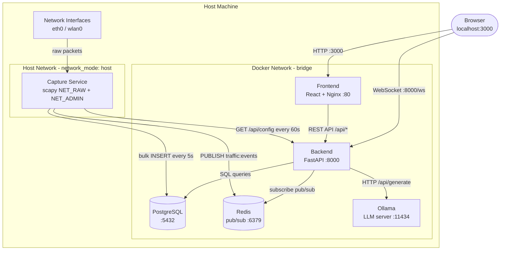

# System Architecture Diagram

## Component Architecture

---

## Data Flow Summary

| Flow | From | To | Transport | Frequency |
|---|---|---|---|---|
| Raw packets | Network interface | Capture service | OS kernel | Every packet |
| Normalized events | Capture service | Redis `traffic:events` | Redis pub/sub | Every packet |
| Bulk event storage | Capture service | PostgreSQL | SQL INSERT | Every 5 seconds |
| Config polling | Capture service | Backend API | HTTP GET | Every 60 seconds |
| Real-time events | Redis | WebSocket clients | WebSocket | Every packet |
| New alerts | Rule Engine | Redis `alerts:new` | Redis pub/sub | On rule match |
| Alert enrichment | AI Agent 1 | Redis `alerts:updated` | Redis pub/sub | ~3-10s after alert |
| UI updates | Backend WebSocket | Browser | WebSocket | Real-time |
| API queries | Browser | Backend | HTTP REST | On user interaction |
| LLM inference | AI Agents | Ollama | HTTP POST | On alert/incident |

---

## Port Exposure Map

| Service | Internal Port | Exposed to Host | Purpose |
|---|---|---|---|
| Frontend (Nginx) | 80 | 3000 | Serve React app to browser |
| Backend (FastAPI) | 8000 | 8000 | REST API + WebSocket |
| PostgreSQL | 5432 | 5432 | Direct DB access (dev only) |
| Redis | 6379 | 6379 | Debug access (dev only) |
| Ollama | 11434 | 11434 | LLM API (dev only) |
| Capture | host | host | Must see real network interfaces |
