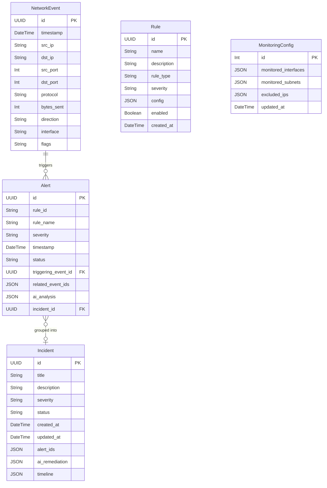

# Database Entity-Relationship Diagram



---

## Field Details

### NetworkEvent
| Field | Type | Notes |
|---|---|---|
| id | UUID | Primary key |
| timestamp | DateTime | When the packet was captured |
| src_ip | String(45) | Supports IPv6 |
| dst_ip | String(45) | Supports IPv6 |
| src_port | Int | Nullable for ICMP |
| dst_port | Int | Nullable for ICMP |
| protocol | String | TCP / UDP / ICMP / OTHER |
| bytes_sent | Int | Packet size in bytes |
| direction | String | inbound / outbound / internal |
| interface | String | e.g. eth0, wlan0 |
| flags | String | Nullable — TCP flags: SYN, ACK, FIN, RST |

### Alert
| Field | Type | Notes |
|---|---|---|
| id | UUID | Primary key |
| rule_id | String | References Rule by name/id |
| rule_name | String | Human-readable rule name |
| severity | String | low / medium / high / critical |
| timestamp | DateTime | When alert was created |
| status | String | open / acknowledged / false_positive / resolved |
| triggering_event_id | UUID FK | The event that crossed the threshold |
| related_event_ids | JSON | List of UUIDs of all events in the window |
| ai_analysis | JSON | Null until Agent 1 fills it |
| incident_id | UUID FK | Null until grouped into an incident |

### Incident
| Field | Type | Notes |
|---|---|---|
| id | UUID | Primary key |
| title | String | Analyst-provided title |
| severity | String | Derived from max severity of included alerts |
| status | String | open / in_progress / resolved |
| alert_ids | JSON | List of Alert UUIDs included |
| ai_remediation | JSON | Null until Agent 2 fills it |
| timeline | JSON | Null until Agent 2 fills it |

---

## ai_analysis JSON Structure (stored in Alert)

```json
{
  "threat_assessment": "2-3 sentence explanation",
  "severity_justification": "Why this severity level is appropriate",
  "mitre_tactic": "Reconnaissance",
  "mitre_technique": "T1046 - Network Service Discovery",
  "confidence": 0.87,
  "is_false_positive_likely": false,
  "recommended_action": "Isolate 192.168.1.100 from network access immediately",
  "iocs": ["192.168.1.100"],
  "analyzed_at": "2024-01-15T10:30:08Z",
  "error": "Only present if Ollama failed"
}
```

## ai_remediation JSON Structure (stored in Incident)

```json
{
  "summary": "High-level attack description",
  "attack_pattern": "Reconnaissance followed by credential attack",
  "mitre_tactics": ["Reconnaissance", "Initial Access"],
  "mitre_techniques": ["T1046 - Network Service Discovery", "T1110 - Brute Force"],
  "timeline": [
    {
      "timestamp": "2024-01-15T10:30:05Z",
      "event": "Port scan initiated from 192.168.1.100",
      "alert": "Port Scan Detection",
      "significance": "Reconnaissance phase begins"
    }
  ],
  "remediation_steps": [
    "1. IMMEDIATE: Block outbound connections from 192.168.1.100",
    "2. SHORT-TERM: Audit SSH login history on affected host"
  ],
  "iocs": ["192.168.1.100", "192.168.1.10"],
  "analyzed_at": "2024-01-15T10:35:00Z"
}
```

## Rule config JSON Examples

```json
{ "metric": "unique_dst_ports", "window_seconds": 60, "threshold": 20 }

{ "metric": "event_count", "filter_dst_port": 22, "filter_protocol": "TCP",
  "filter_flags": "SYN", "window_seconds": 30, "threshold": 10 }

{ "metric": "event_count", "window_seconds": 60, "threshold": 500 }
```
