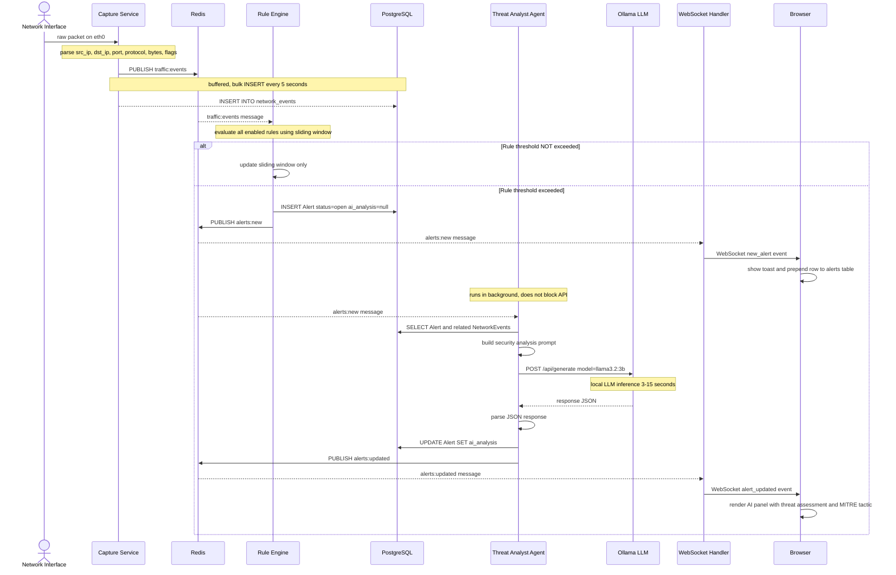
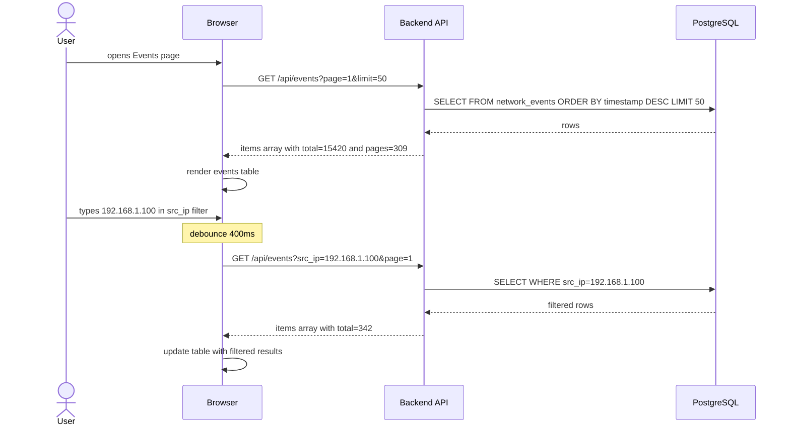

# Sequence Diagram — Packet Capture to Alert to AI Analysis

This diagram shows the full real-time flow from a raw network packet arriving on the network
interface all the way to the browser displaying an AI-enriched alert.

---

# Sequence Diagram — User Views Historical Events (US-05)

