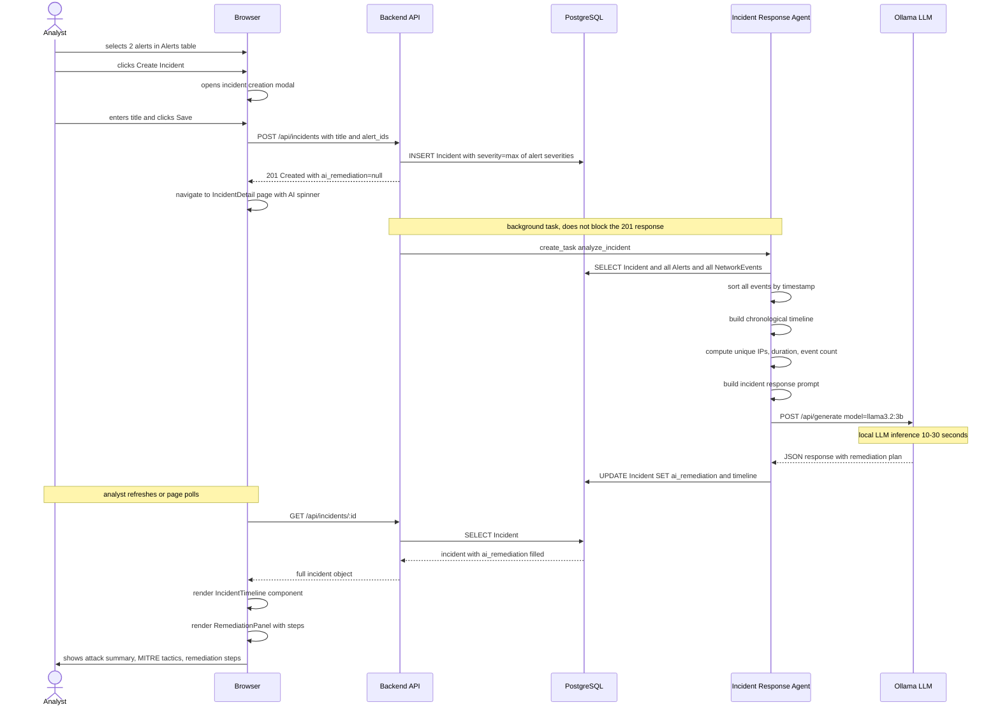
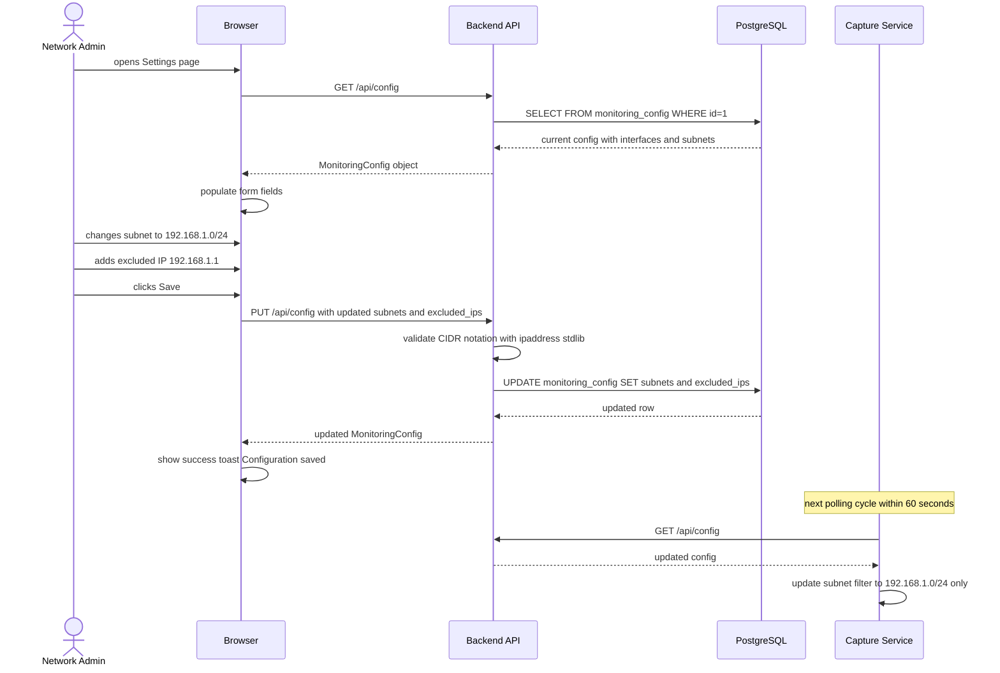

# Sequence Diagram — Incident Creation and AI Agent 2

This diagram shows how a security analyst creates an incident from multiple related alerts,
and how AI Agent 2 automatically produces a remediation plan and reconstructed timeline.

---

# Sequence Diagram — User Configures Monitoring Scope (US-06)

